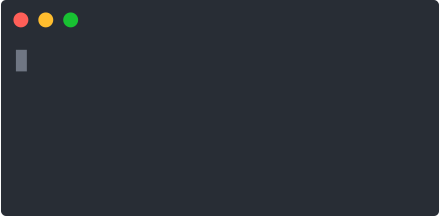

<!-- <p align="center">
	<br>
	
	<br>
	<br>
</p> -->

The list of spinners is just a [JSON file](spinners.json) and can be used wherever.

## Install

```sh
npm install https://github.com/mahankals/cli-steps.git
```

## Usage

```js
const cliProcess = require('cli-steps');
const process = new cliProcess({
  style: 'binary',
  success: 'Finish',
  fail: 'Fail',
});

process.start();
process.text = "Downloading 0%";

let progressPercent = 0;

const updateProgress = () => {
  if (progressPercent <= 100) {
    process.text = `Downloading ${progressPercent}%`;

    setTimeout(() => {
      progressPercent += 10; // Update progress by 10%
      updateProgress();
    }, 1000);
  } else {
    process.succeed("Download completed.");
  }
};

updateProgress();
```